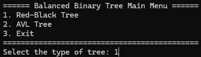
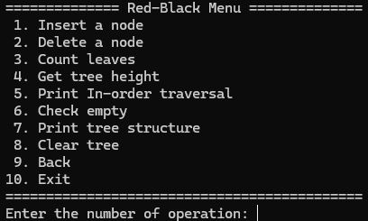
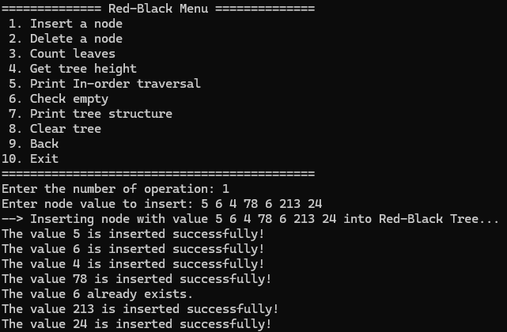
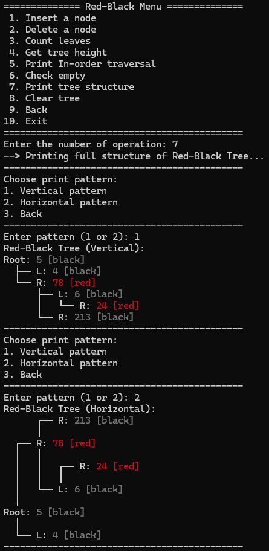

# Rust Balanced Trees

A Rust implementation of two self-balancing binary search trees: **Red-Black Tree** and **AVL Tree**.

This project provides a reusable tree framework with shared abstractions for common tree operations, generic rotation logic, an interactive command-line interface, and benchmarking support.
## How to Use
Make sure Rust and Cargo are installed.
Build the project:
`cargo build`
Run the CLI:
`cargo run`
Run benchmarks:
`cargo bench`
### Interactive CLI menu
Enter the corresponding number to select type of trees.

Enter the corresponding number to select operations.

Let's insert some nodes into the Red-Black tree.

Print the tree stucture to check.

## Features

- Implemented **Red-Black Tree** and **AVL Tree** from scratch in Rust
- Shared reusable abstractions through `TreeNode<T>` and `TreeOps<T>`
- Generic `rotate()` helper for common balancing cases
- Interactive CLI for testing and exploring tree operations
- Benchmarking support with **Criterion**
- Modular design for easier extension to new tree types

## Design Highlights

This project separates the **tree framework** from the **balancing policy**.

The shared module `common.rs` defines reusable traits and helper functions:

- `TreeNode<T>` for per-node behavior
- `TreeOps<T>` for high-level tree operations

Common functionality such as leaf counting, height calculation, traversal, printing, and generic rotation logic is implemented once and reused across both Red-Black Tree and AVL Tree implementations.

This modular structure reduces duplicated code and makes the project easier to maintain and extend.

## Project Structure

- `common.rs` - shared traits and reusable helper functions
- `avl.rs` - AVL Tree implementation
- `red_black.rs` - Red-Black Tree implementation
- `main.rs` - command-line interface
- `benches/` - Criterion benchmarks

